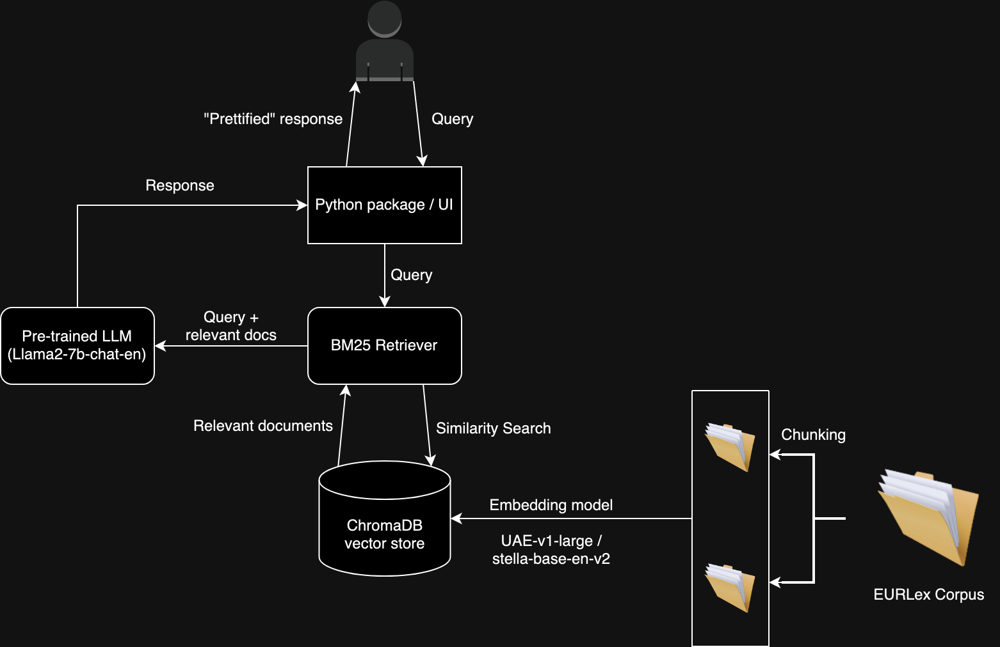

<h1>LLM Legal Assistant</h1>
<h3>
Team Members:
</h3>
Assignment Group 17
<ul>
<li>Siddhant Tripathi (siddhant.tripathi@stud.uni-heidelberg.de)</li>
	Setup the base pipeline for RAG,to experiment on different configuration, wrote code for different retriever methods and co-authored evaluation pipeline with Kushal Gaywala.
	Added SemanticChunker as one of chunking strategy. Helped with research for embedding models, chunking strategies and Retreiver Models, co-created with Kushal Gaywala Response Dataset to compare with Ground Truth/Gold Data to facilitate evaluation of RAG pipeline.
<li>Asma Motmem (asma.motmem@stud.uni-heidelberg.de)</li>
Researched embedding models, evaluated them using various retrieval methods, generated a synthetic dataset for fine-tuning the language model, and assisted teammates in coding, debugging and pair programming.
<li>Kushal Gaywala (kushal.gaywala@stud.uni-heidelberg.de)</li>
First, downloaded the csv files from the EUR-lex [website](https://eur-lex.europa.eu/homepage.html), then helped Mohit Shrestha with the fetching and pre-processing part. Second, set up of the project's structure. Third, created a module for different splitters implemented in <a href="https://www.llamaindex.ai/">LlamaIndex</a>. Fourth, merged different modules created by different members into a single evaluation pipeline. Fifth, created the command prompt client for normal user use mentioned in <a href="https://github.com/mmshress/INLP-WS23/blob/project_report/README.md">README</a>. Sixth, completed evaluations, collected metrics with Siddhant Tripathi. Seventh, created different plots that should be used for analysis, to decide a configuration to be used for final application.
<li>Mohit Shrestha (mohit.shrestha@stud.uni-heidelberg.de)</li>
Setup the fetching and pre-processing pipelines for the EUR-Lex corpus, setup the Docker compose files for our initial idea of having an OpenSearch vector store (later pivoted to ChromaDB),
initial LlamaIndex orchestration, wrote the bulk of the code for indexing and interfacing with the OpenSearch/ChromaDB vector stores, helped with research for
proper embedding models and chunking strategies, created synthetic dataset of question/answer/context triplets for evaluation of RAG pipeline along with engineering the prompt for the same,
general refactoring of the codebase, editing of the majority of the project report
</ul>
<h4>Advisor: Prof. Dr. Michael Gertz</h4>
We hereby certify that we have written the work ourselves and that we have not used any sources or aids other than those specified and that we have marked what has been taken over from other people's works, either verbatim or in terms of content, as foreign.

<h2>Introduction</h2>
In this project, we explore a possible approach to create a question answering system for a domain-specific corpus. In our case, the corpus we based our system on is from the legal domain, specifically all the [EUR-Lex](#EURLex) English language articles from the "energy" domain.
While large language models (LLMs) have recently become the go-to technology for most chatbot and question answering systems, they come with their own set of limitations. A particular problem that could discourage the use of LLMs for our purpose is the fact that LLMs tend to be trained on a generalized language corpus. This leads to difficulties in receiving answers with information relevant to the specific domain we want answers from.
To circumvent this, we employ an approach that has gained a lot of traction in recent times: a retrieval-augmented generation (RAG) pipeline.
By retrieving relevant information from the domain-specific corpus before using the LLM to answer questions, we ensure that the answers we receive all come from the corpus, instead of from the general parameters of the LLM. To determine the best possible pipeline for our system, we evaluate multiple embedding models, chunking strategies as well as query retrieval strategies. Finally, we package the optimal pipeline from our evaluations in Python for use as a QA system.

<h2>Related Work</h2>
[Gao2023](#Gao2023) highlights the limitations of Large Language Models (LLMs), such as hallucination, outdated knowledge, and non-transparent reasoning,
and introduces Retrieval-Augmented Generation (RAG) as a promising solution. RAG addresses these issues by incorporating knowledge from external databases,
enhancing accuracy and credibility, particularly for knowledge-intensive tasks. The synergy between RAG and LLMs involves merging intrinsic knowledge with
dynamic external repositories. Overall, RAG offers a comprehensive solution that combines the strengths of LLMs with external knowledge to overcome their limitations.
Our project uses RAG in a similar vein to bypass the limitations of LLMs.

The focus of [Lala2023](#Lala2023) is on applying RAG models, specifically demonstrated by PaperQA, to process scientific knowledge systematically. PaperQA, as a question-answering agent,
conducts information retrieval across full-text scientific articles, evaluates source and passage relevance, and utilizes RAG for answering questions.
The performance of PaperQA surpasses existing LLMs and LLM agents on current science question-answering benchmarks. Similar to their work on the scientific domain,
our project aims to compare the relative performance of QA systems on the legal domain.

[Siriwardhan2023](#Siriwardhana2023) also aims to improve the adaptation of RAG systems to a range of domains, and we use similar techniques in our system for the legal domain.
Overall, there are almost no standalone papers exploring the performance of RAG systems particularly on the legal domain, and our project aims to provide such a baseline.
<H2>Methods/Approach</h2>
A rough overview of the system we have designed can be seen in the following diagram:



For the overall orchestration of our RAG Pipeline, we used the [Llama Index](#LlamaDocs) framework.

The first step in realizing our system was to obtain the EUR-Lex dataset comprising of 511 documents and pre-process it to a digestible format for our embedding models. For this, we tried three different file formats offered by EUR-LEx - plain text, markdown and HTML. Although HTML and Markdown would have given us more contextual information owing to their structured nature,
the files did not share a common data model / structure of any kind. This led to difficulties for us in parsing the hierarchies present in the documents, so in the end we opted to just use the plain text files.

To pre-process our dataset, we used some basic regular expressions to clean up lines in the files not relevant to the text, such as XML tags and metadata information. Thereafter, we proceeded with deciding on chunking strategies for our corpus.

When handling lengthy text, it becomes essential to break it down into smaller chunks. Despite the apparent simplicity of this task, it introduces potential complexities. The goal is to ideally group together text segments that are semantically related.
In our approach we tested each of the embedding models mentioned earlier with the 4 different levels of chunking strategies inspired by <a href="#Greg Kamradt">5 levels of Text Splitting by Greg Kamradt</a>.

The first level is the token splitter which is implemented in the [llama_index.core.node_parser module](#LlamaDocs). It aims to break text into consistent chunks based on raw token counts. This is achieved by specifying parameters such as chunk size and overlap. For instance, in our code, a TokenTextSplitter instance is created with a chunk size of 512 tokens and a chunk overlap of 20 tokens. Subsequently, the splitter is applied to a collection of documents , resulting in a set of nodes representing the segmented text.

Next level is Recursive Character Text Splitter where  the text is recursively divided into smaller chunks using a set of separators in an iterative manner.If the first attempt to divide the text fails to produce chunks of the appropriate size, the function recursively runs itself on the resultant chunks using alternative separators until the target chunk size is achieved.

The Sentence Splitter (third level), featured also in [the llama_index.core.node_parser module](#LlamaDocs), endeavors to segment text by adhering to sentence boundaries. Unlike the Token Text Splitter, this class prioritizes keeping sentences and paragraphs intact, reducing the likelihood of incomplete or dangling sentences at the end of each node chunk.

The final chunking method is implemented as the SemanticChunker within the LlamaIndex module, aims to extract semantic meaning from embeddings and evaluate the semantic relationships between these chunks. The fundamental concept revolves around grouping together chunks that share semantic similarity. Unlike fixed-size chunking methods, the semantic splitter dynamically selects breakpoints between sentences based on embedding similarity. This guarantees that a "chunk" comprises sentences that share semantic relevance with one another.

To use this method, an instance of the SemanticChunker is created with an embedding model and incorporated into the [LangchainNodeParser](#LangchainDocs).

After the chunking of the documents are done, the next step is to create the vector embeddings for the embeddings and store them. As our vector store, we initially used a locally hosted instance of OpenSearch, orchestrated using a Docker Compose file. However, later we pivoted to a ChromaDB vector store instead, after finding out that this would be more suited to our needs. The embedding models we have used are:

Text embedding "UAE-v1-large"  is better for tasks that involve understanding the meaning of text, which is important for large language models. Current models struggle with a common issue called vanishing gradients, mainly because of how they use the cosine function in their optimization process. but "UAE-v1-large" overcome this problem [Li 2023](#Li2023).

The stella V2 embedding model, recently open-sourced on October 19 2023, offers a simple and user-friendly experience, eliminating the need for any prefixed text. The stella model, designed for general-purpose text encoding, comprises various main models [Stella - HuggingFace](#StellaHF).

The key difference between the two models is the architecture such that "UAE-v1-large" is  described as an angle-optimized text embedding model focusing on mitigating the adverse effects of the cosine saturation zone. Stella V2, on the other hand, is a general-purpose text encoding model with various main models, building on the stella model by using more training data and incorporating methods like knowledge distillation.

After the embeddings are created and stored in our vector database, the next step is to use a retriever model to interface with the user query, and then provide the query along with the relevant documents from a vector database to the QueryEngine for question answering. The retriever forwards the query and the relevant docs from the similarity search, and then the LLM generates the final answer to be given back to the user. For this we use three different types of retriever models. Firstly, the well-known [BM25](#BM25) keyword based retriever model provided out of the box by LlamaIndex. Secondly, a VectorStoreRetriever model, which is a lightweight wrapper around the vector database class to make it conform to the retriever interface. It uses the search methods implemented by a vector store, like similarity search to retrieve topK similar documents. At the core of VectorStoreRetriever model is an embedding model, which is used to embed the chunks into vectors and then these embeddings are stored in vector database. VectorStoreRetrieval models are also known as DenseRetrieval models as they are based on dense vectors. Finally, we use FusionRetriever model, which combines both keyword and vectorstore retriever models. The topK documents retrieved by both the retriever models are re-ranked through Reciprocal Rank Fusion (RRF), a technique for combining the ranks of multiple search
result lists to produce a single, unified ranking. [Cormack et al., 2009](#RRF).

The final step for RAG pipeline is a QueryEngine which is responsible for querying, which is in our a RetrieverQueryEngine. A RetrieverQueryEngine as it's name suggest, built on top on of a retriever and feeds the llm the query and retrieved document as context to LLM and returns a response based on the information provided.

<h2>Experimental Setup and Details</h2>
<h3>Test Data</h3>
We created a synthetic dataset. The primary objective of this dataset is to assess the performance of our RAG (Retrieval-Augmented Generation) system. Initially, we leverage the capabilities of the Llamaindex llama_dataset class to synthesize data. This entails a randomized selection of 20 documents from our corpus, followed by prompting ChatGPT to formulate questions based on these documents. The resultant questions, along with their respective answers and contextual information, are organized into JSON format triplets.

Subsequently, we utilize the LabelledRagDataset class to organize these triplets into a cohesive dataset. This dataset plays a pivotal role in our project as it serves as the foundation for evaluating the effectiveness of our RAG system. By providing queries (questions), reference answers, and context, we can meticulously analyze the system's performance. Specifically, we evaluate the system's ability to generate accurate responses by comparing them against the reference answers. This evaluation process allows us to iteratively refine and enhance the performance of our RAG system.
<h3>Evaluation Method</h3>
<a href="#Liu2023">[Liu2023]</a> suggests that LLM-based evaluation methods have high correlation to human judgement than conventional reference based metrics such as BLEU and ROUGE, although pointing out that LLM-based evaluation can have slight bias towards LLM-generated text in giving higher ratings.

We use LlamaIndex RagEvaluator pack which offers "LLM-Based" evaluation modules to measure the quality of results. This uses a “gold” LLM (e.g. GPT-4, in our case: gpt-3.5-turbo) to decide whether the predicted answer is correct in a variety of ways. Since LLM-Based evaluation can be costly, we first make use of  <a href="#BERTScore"> BERTScore </a>, an automatic evaluation metric for text generation. Analogously to common metrics,BERTScore computes a similarity score for each token in the candidate sentence with each token in the reference sentence. However, instead of exact matches, compute token similarity using contextual embeddings.After comparing BERTScore, we choose top 3 configuration to evaluate using RagEvaluator.

The LLM-based evaluation metrics are in the following forms:
<ul>
    <li> Correctness: Whether the generated answer matches that of the reference answer (from dataset) given the query. This is done by giving a prompt to LLM to rate the correctness, by giving a score between 1 to 5, where 5 being the most correct.
	<li> Faithfulness: Evaluates if the answer (from dataset) is faithful to the retrieved contexts (in other words, whether if there’s hallucination). This also done by giving a prompt to LLM and asking whether the given information is supported by the context and return 1 or 0 for yes and no.
	<li> Relevancy: Whether retrieved context and generated answer are relevant to the query. Again, done by giving a prompt to LLM asking whether the given information (context and answer) is relevant to the query.
</ul>
<h3>Experimental Details</h3>

The LLM used for evaluation is `gpt-3.5-turbo`, the embedding model is `text-embedding-3-large`.

The prompts given to Correctness, Faithfulness, and Relevancy are as follows:

<h4>Correctness</h4>

```
You are an expert evaluation system for a question answering chatbot.

You are given the following information:
- a user query, and
- a generated answer

You may also be given a reference answer to use for reference in your evaluation.

Your job is to judge the relevance and correctness of the generated answer.
Output a single score that represents a holistic evaluation.
You must return your response in a line with only the score.
Do not return answers in any other format.
On a separate line provide your reasoning for the score as well.

Follow these guidelines for scoring:
- Your score has to be between 1 and 5, where 1 is the worst and 5 is the best.
- If the generated answer is not relevant to the user query, \
you should give a score of 1.
- If the generated answer is relevant but contains mistakes, \
you should give a score between 2 and 3.
- If the generated answer is relevant and fully correct, \
you should give a score between 4 and 5.

Example Response:

4.0

The generated answer has the exact same metrics as the reference answer, \
    but it is not as concise.
```

<h4>Faithfulness</h4>

    Please tell if a given piece of information
    is supported by the context.
    You need to answer with either YES or NO.\n
    Answer YES if any of the context supports the information,even
    if most of the context is unrelated.
    Some examples are provided below. \n\n
    Information: Apple pie is generally double-crusted.\n
    Context: An apple pie is a fruit pie in which the principal filling
    ingredient is apples. \n
    Apple pie is often served with whipped cream, ice cream
    ('apple pie à la mode'), custard or cheddar cheese.\n
    It is generally double-crusted, with pastry both above
    and below the filling; the upper crust may be solid or
    latticed (woven of crosswise strips).\n
    Answer: YES\n
    Information: Apple pies tastes bad.\n
    Context: An apple pie is a fruit pie in which the principal filling
    ingredient is apples. \n
    Apple pie is often served with whipped cream, ice cream
    ('apple pie à la mode'), custard or cheddar cheese.\n
    It is generally double-crusted, with pastry both above
    and below the filling; the upper crust may be solid or
    latticed (woven of crosswise strips).\n
    Answer: NO\n
    Information: {query_str}\n
    Context: {context_str}\n
    Answer:

<h4>Relevancy</h4>

    Your task is to evaluate if the response for the query
    is in line with the context information provided.\n
    You have two options to answer. Either YES/ NO.\n
    Answer - YES, if the response for the query \
    is in line with context information otherwise NO.\n"
    Query and Response: \n {query_str}\n
    Context: \n {context_str}\n
    Answer:
<h3>Results and Analysis</h3>
We plotted the BERTScore of three different Retriever models for various configuration based on chunking strategy and embedding model used.
For precision, as expected, the QueryFusionRetriever models performs relatively well as compared to other methods.  Since BERTScore is based on embeddings similarity/ contextual similarity, it implies the QueryFusionRetriever was able to retrieve context more semantically related to ground truth context. Through the plots we can deduce that, if the plot is more thicker on down, it has lower scores for most of contexts than contexts with high scores. Same can be said for recall and F1 scores. 
For our suprise the embedding model infgrad/stella-base-en-v2 have comparable results and in many cases also better then UAE-v1-large, which is 6 times bigger in size than stella and have far better ranking. So maybe, bigger the better maybe not always true.


And after evaluating more than 15 different configuration of chunking strategy, embedding model and retriever model using BERTScore, due to cost issues, we could evaluate only 3 configuration on LLM-based evaluation.  Using the above given prompt we ask LLM gpt-3.5-turbo to give score to the answer generated by our RetriverOueryEngines. Our top performing configuration 
semantic-stella-fusion, which use a Semantic chunker based on Stella, and a fusionRetriver based on bm25Retriver and VectorRetiver, which is build using stella embedding model and chromadb also performs well, based on LLM-based evaluation. Other configurations tested were senmantic-UAE-fusion which differs the previous one by use of different embedding model. The third one was our top perfroming BM25RetriverModel which is based on RecursiveCharacterTextSplitting.


<h2>References</h2>
<ul>
<li id="EURLex">European Union. (n.d.). EUR-Lex portal, access to European law. https://eur-lex.europa.eu/homepage.html</li>
<li id="Gao2023">Gao, Y., Xiong, Y., Gao, X., Jia, K., Pan, J., Bi, Y., ... & Wang, H. (2023). Retrieval-augmented generation for large language models: A survey. arXiv preprint arXiv:2312.10997.</li>
<li id="Siriwardhana2023">Siriwardhana, S., Weerasekera, R., Wen, E., Kaluarachchi, T., Rana, R., & Nanayakkara, S. (2023). Improving the domain adaptation of retrieval augmented generation (RAG) models for open domain question answering. Transactions of the Association for Computational Linguistics, 11, 1-17.</li>
<li id="Lala2023">Lála, J., O'Donoghue, O., Shtedritski, A., Cox, S., Rodriques, S. G., & White, A. D. (2023). Paperqa: Retrieval-augmented generative agent for scientific research. arXiv preprint arXiv:2312.07559.</li>
<li id="Liu2023"> Liu, Y., Iter, D., Xu, Y., Wang, S., Xu, R., & Zhu, C. (2023). Gpteval: Nlg evaluation using gpt-4 with better human alignment. arXiv preprint arXiv:2303.16634.</li>
<li id="Risch2021">Risch, J., Möller, T., Gutsch, J., & Pietsch, M. (2021). Semantic answer similarity for evaluating question answering models. arXiv preprint arXiv:2108.06130.</li>
<li id="LlamaDocs">LlamaIndex Documentation, Accessed 2 Mar. 2024. https://docs.llamaindex.ai/en/stable/</li>
<li id="LangchainDocs">LangChain Python API documentation. Accessed 2 Mar. 2024. https://api.python.langchain.com/en/latest/</li>
<li id="Li2023">Li, X., & Li, J. (2023). Angle-optimized text embeddings. arXiv preprint arXiv:2309.12871.</li>
<li id="StellaHF">Stella Base embedding model - HuggingFace. Accessed 2 Mar. 2024. https://huggingface.co/infgrad/stella-base-en-v2</li>
<li id="BM25">Robertson, S., & Zaragoza, H. (2009). The probabilistic relevance framework: BM25 and beyond. Foundations and Trends® in Information Retrieval, 3(4), 333-389.</li>
<li id ="Greg Kamradt"> 5 levels of Text Splitting https://github.com/FullStackRetrieval-com/RetrievalTutorials/blob/main/5_Levels_Of_Text_Splitting.ipynb </li>
<li id = "RRF">Gordon V. Cormack, Charles L A Clarke, and Stefan Buettcher. 2009. Reciprocal rank fusion outperforms condorcet and individual rank learning methods. In Proceedings of the 32nd international ACM SIGIR conference on Research and development in information retrieval (SIGIR '09). Association for Computing Machinery, New York, NY, USA, 758–759. https://doi.org/10.1145/1571941.1572114</li>
<li id ="BERTScore">BERTScore: Evaluating Text Generation with BERT Tianyi Zhang, Varsha Kishore, Felix Wu, Kilian Q. Weinberger, Yoav Artzi https://arxiv.org/abs/1904.09675</li>
</ul>
